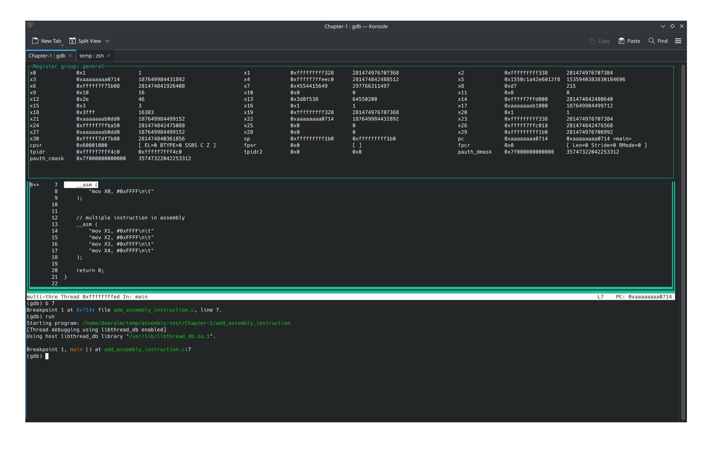
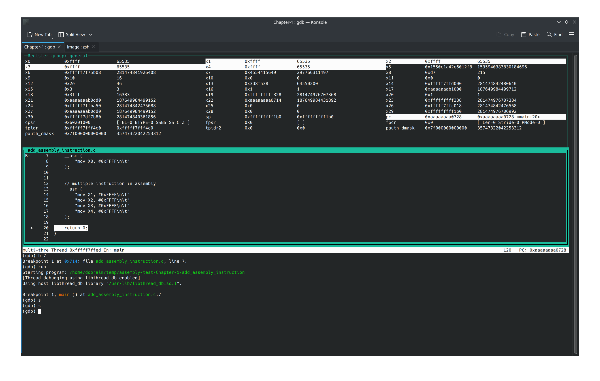

# C-test

## Assembly and C

### Test 1

* `add_function_assembly.c`. Script that implements a function in Assembly to be able to do sum of two numbers.
* `assembly_instruction.c`. Script showing how to insert assembly code into a C program.

#### `assembly_instruction`

Before script run

After script run

